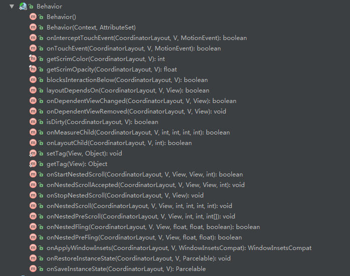

# AndroidMaterial
use meterial design
##RecyclerView
要加上下面这段代码，才能显示
```
RecyclerView.setLayoutManager(new LinearLayoutManager(view.getContext()));
```
如果使用android.support.design.widget.CoordinatorLayout进行界面布局时候，内容区域需要加上 app:layout_behavior="@string/appbar_scrolling_view_behavior"
```xml
     <fragment
         android:name="edu.ptu.newfuture.RecycleviewListFragment"
         android:layout_width="match_parent"
         app:layout_behavior="@string/appbar_scrolling_view_behavior"
         android:layout_height="match_parent"
         android:tag="frgm_recleview" />
```
##Behavior
>Behaviors can use this to monitor inbound touch events until one decides to intercept the rest of the event stream to take an action on its associated child view. This method will return false until it detects the proper intercept conditions, then return true once those conditions have occurred.

继承 **android.support.design.widget.HeaderBehavior** ->  **android.support.design.widget.ViewOffsetBehavior** -> **android.support.design.widget.CoordinatorLayout.Behavior**


- CoordinatorLayout.Behavior为抽象类，只定义一系列方法。
- ViewOffsetBehavior 
```java 
```

##Dialog
[Dialog link](./Dialog/Dialog.md)
